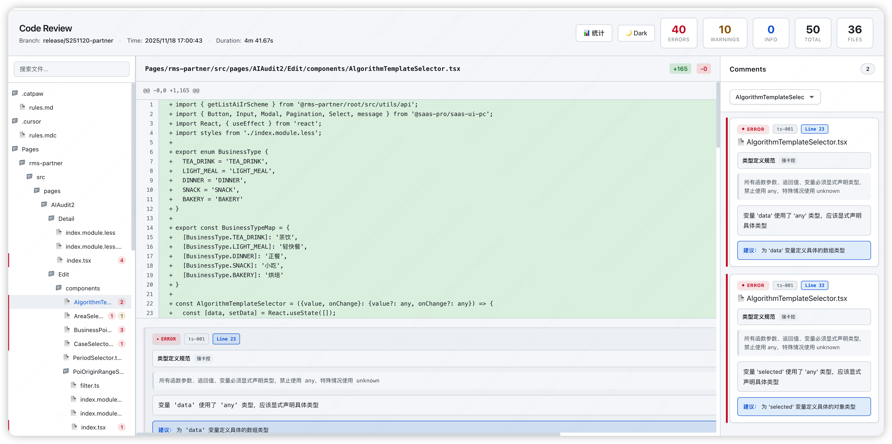
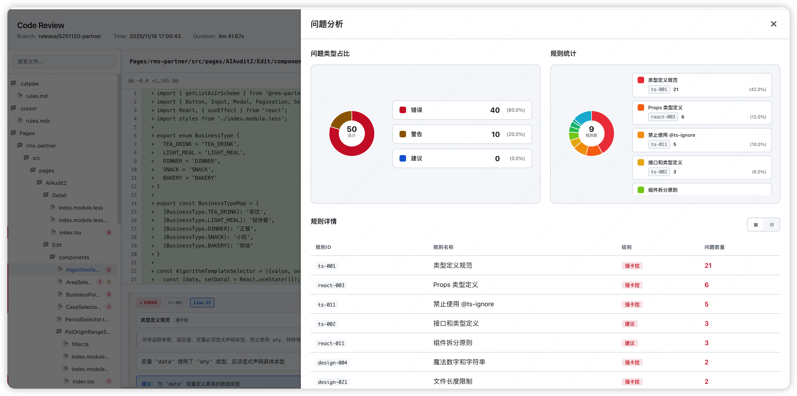
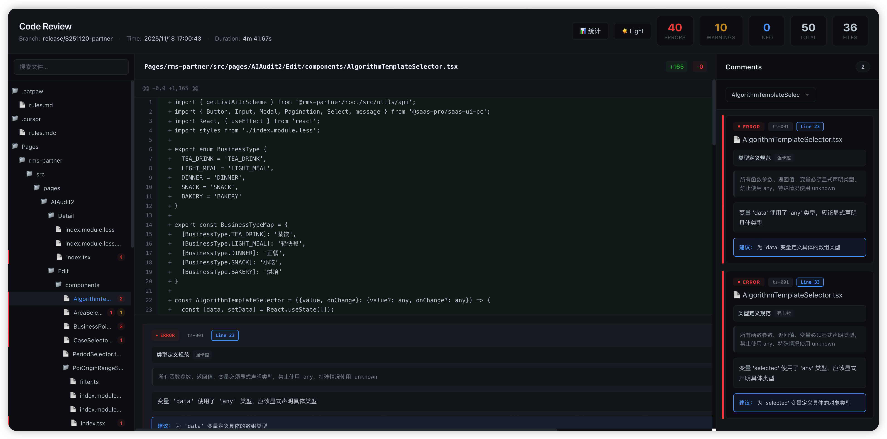
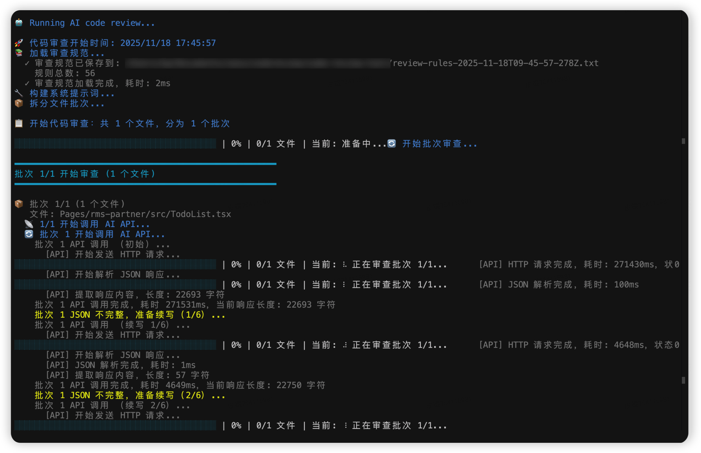
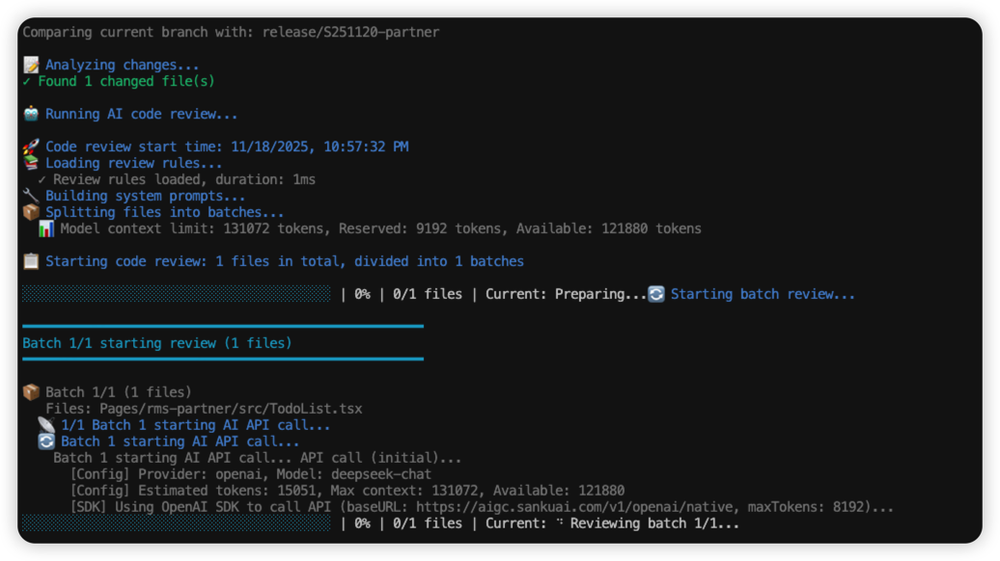

# @aicodereview/ai-code-review

[](https://www.npmjs.com/package/@aicodereview/ai-code-review)
[](https://opensource.org/licenses/MIT)

**语言**: [English](./README.md) | [中文](./README.zh-CN.md)

基于大语言模型（LLM）的 AI 代码审查工具，可自动审查代码变更。支持多种 LLM 提供商，包括 OpenAI、Anthropic、Moonshot 和自定义提供商。

## 📸 截图

### 审查仪表板


### 统计面板


### 代码审查界面


### 规则统计视图


### 详细审查评论


## 🌟 功能特性

### 核心能力

- 🤖 **AI 代码审查**：使用先进的 LLM 模型自动审查代码变更
- 🔍 **Git 集成**：无缝对比分支并分析代码差异
- 📊 **交互式 Web UI**：类似 GitHub 的界面，用于查看审查结果
- 🎯 **基于规则的审查**：内置 TypeScript、React 和代码设计最佳实践规则
- 🔄 **批量处理**：智能地将大型变更集拆分为可管理的批次
- 📝 **详细评论**：提供逐行评论，包含严重程度级别和建议
- ⚡ **快速高效**：优化的 token 估算和上下文管理

### LLM 提供商支持

- **OpenAI**：GPT-3.5、GPT-4 和其他 OpenAI 模型
- **Anthropic**：通过 Anthropic API 使用 Claude 模型
- **Moonshot**：Moonshot AI 模型
- **自定义**：支持任何 OpenAI 兼容的 API 端点（例如 DeepSeek）

### 高级功能

- 🌐 **国际化**：支持英文和简体中文
- 🔁 **重试机制**：自动重试不完整的 JSON 响应
- 📈 **统计仪表板**：全面的统计和问题分析
- 🔗 **GitHub 集成**：自动将审查结果发布为 PR 评论
- 💾 **导出结果**：将审查结果保存为 JSON 文件
- 🎨 **主题支持**：Web UI 支持浅色和深色主题

## 📦 安装

### 全局安装（推荐）

```bash
npm install -g @aicodereview/ai-code-review
```

### 本地安装

```bash
npm install --save-dev @aicodereview/ai-code-review
```

### 从源码安装

```bash
git clone <repository-url>
cd ai-codereview
npm install
npm run build
```

## ⚙️ 配置

### 环境变量

在项目根目录创建 `.env` 文件或设置环境变量：

```bash
# 必需
LLM_API_KEY=your_api_key_here

# 可选 - LLM 提供商配置
LLM_PROVIDER=openai          # 选项: openai, anthropic, moonshot, custom
LLM_MODEL_NAME=gpt-3.5-turbo # 模型名称（根据提供商而异）
LLM_BASE_URL=                # 自定义提供商必需
LLM_MAX_TOKENS=8192          # 最大输出 tokens

# 可选 - 语言
LANG=zh-CN                   # 选项: en, zh-CN (默认: en)
```

### `.env` 文件示例

**OpenAI:**
```bash
LLM_PROVIDER=openai
LLM_MODEL_NAME=gpt-4
LLM_API_KEY=sk-...
```

**Anthropic:**
```bash
LLM_PROVIDER=anthropic
LLM_MODEL_NAME=claude-3-opus-20240229
LLM_API_KEY=sk-ant-...
```

**自定义（DeepSeek）:**
```bash
LLM_PROVIDER=custom
LLM_MODEL_NAME=deepseek-chat
LLM_BASE_URL=https://api.deepseek.com
LLM_API_KEY=sk-...
```

## 🚀 快速开始

### 基本用法

```bash
# 对比 master 分支进行审查
code-review master

# 对比指定分支进行审查
code-review develop

# 交互式分支选择
code-review

# 使用自定义规则
code-review master --rules ./custom-rules.json

# 仅保存结果，不启动服务器
code-review master --no-server --output ./review-results

# 使用中文
code-review master --lang zh-CN
```

### GitHub PR 集成

```bash
# 审查并发布到 GitHub PR
code-review-github \
  --github-token $GITHUB_TOKEN \
  --github-owner owner \
  --github-repo repo \
  --github-pr 123 \
  --pwd /path/to/repo
```

## 📖 使用指南

### 命令行选项

#### `code-review` 命令

```bash
code-review [baseBranch] [options]

选项:
  -r, --rules <files...>     加载额外的规则 JSON 文件
  -p, --pwd <directory>      工作目录（默认: 当前目录）
  --env <file>               .env 文件路径（默认: .env）
  --no-server                不启动审查报告服务器
  -o, --output <directory>   JSON 文件输出目录
  --max-retries <number>     不完整 JSON 的最大续写次数（默认: 10）
  --lang <language>          语言: en 或 zh-CN（默认: en）
  -h, --help                 显示帮助
  -V, --version              显示版本
```

#### `code-review-github` 命令

```bash
code-review-github [options]

选项:
  -r, --rules <files...>           加载额外的规则 JSON 文件
  -p, --pwd <directory>            工作目录（默认: 当前目录）
  --env <file>                     .env 文件路径（默认: .env）
  --max-retries <number>           最大续写次数（默认: 10）
  --github-token <token>           GitHub token（或设置 GITHUB_TOKEN 环境变量）
  --github-owner <owner>           仓库所有者（或设置 GITHUB_REPOSITORY_OWNER）
  --github-repo <repo>             仓库名称（或设置 GITHUB_REPOSITORY_NAME）
  --github-pr <number>             PR 编号（或设置 GITHUB_PR_NUMBER）
  --review-event <event>           审查事件: COMMENT, APPROVE, 或 REQUEST_CHANGES
  -o, --output <directory>         JSON 文件输出目录
  --lang <language>                语言: en 或 zh-CN（默认: en）
  -h, --help                       显示帮助
  -V, --version                    显示版本
```

### 工作流程

1. **分支选择**：如果未指定分支，工具会列出所有远程分支供选择
2. **差异分析**：对比当前分支与目标分支，提取代码变更
3. **文件过滤**：自动过滤，仅审查 `.ts` 和 `.tsx` 文件
4. **批量处理**：根据上下文窗口限制将文件拆分为批次
5. **AI 审查**：调用 LLM API 审查每批变更
6. **结果处理**：解析和规范化审查评论
7. **输出**：保存结果并可选启动 Web 服务器

### 审查规则

工具包含以下内置规则：

- **TypeScript**（15 条规则）：类型安全、接口定义、泛型等
- **React**（20 条规则）：组件设计、Hooks 使用、性能优化等
- **代码设计**（21 条规则）：函数设计、代码组织、错误处理等

#### 自定义规则

创建 JSON 格式的自定义规则文件：

```json
{
  "category": "custom",
  "name": "自定义规则",
  "rules": [
    {
      "id": "custom-001",
      "name": "规则名称",
      "description": "规则描述",
      "level": "strict|suggestion|optimization",
      "goodExample": "正确示例代码",
      "badExample": "错误示例代码",
      "reason": "规则存在的原因"
    }
  ]
}
```

加载自定义规则：

```bash
code-review master --rules ./my-rules.json ./team-rules.json
```

## 🎨 Web UI 功能

Web 界面提供：

- **文件树**：浏览变更的文件
- **差异视图**：并排代码对比
- **评论标记**：内联评论，带严重程度指示器
- **统计仪表板**：
  - 问题类型分布（饼图）
  - 规则统计
  - 文件级统计
- **过滤**：按严重程度、文件或规则过滤评论
- **主题切换**：在浅色和深色主题之间切换

## 🔗 GitHub Actions 集成

详细说明请参阅 [README-GITHUB.md](./README-GITHUB.md)。

快速设置：

1. 将 `examples/github-workflow/code-review.yml` 复制到 `.github/workflows/`
2. 配置 GitHub Secrets（LLM_API_KEY 等）
3. 推送代码以在 PR 上触发自动代码审查

## 📊 审查结果格式

### 评论结构

```typescript
{
  filePath: string;        // 文件路径
  line: number;            // 起始行号
  endLine: number;         // 结束行号
  severity: 'error' | 'warning' | 'info';
  message: string;         // 评论消息
  ruleId: string;          // 规则 ID
  ruleName: string;        // 规则名称
  ruleLevel: string;       // 规则级别（strict/suggestion/optimization）
  ruleDesc: string;        // 规则描述
  suggestion?: string;     // 可选建议
  tags?: string[];         // 可选标签
}
```

### 审查结果

```typescript
{
  comments: ReviewComment[];
  summary: string;
  startTime?: string;      // ISO 8601 格式
  endTime?: string;        // ISO 8601 格式
  duration?: number;       // 耗时（毫秒）
}
```

## 🛠️ 开发

### 前置要求

- Node.js 18+
- npm 或 pnpm

### 设置

```bash
# 安装依赖
npm install

# 安装 UI 依赖
cd ui && npm install && cd ..

# 构建
npm run build

# 开发模式
npm run dev master
```

### 项目结构

```
ai-codereview/
├── src/
│   ├── cli.ts              # 主 CLI 入口
│   ├── cli-github.ts       # GitHub CLI 入口
│   ├── git/                # Git 操作
│   ├── review/             # 审查逻辑
│   │   ├── adapters/       # LLM 提供商适配器
│   │   ├── agent.ts        # 审查代理
│   │   └── rules/          # 内置规则
│   ├── server/             # Web 服务器
│   ├── i18n/               # 国际化文件
│   └── utils/              # 工具函数
│       ├── i18n.ts         # 国际化核心
│       ├── github.ts       # GitHub API
│       └── storage.ts      # 文件存储
├── ui/                     # React Web UI
└── examples/               # 示例文件
```

## 🌍 国际化

工具支持多种语言：

- **英文（en）**：默认语言
- **简体中文（zh-CN）**：完整中文支持

通过 CLI 设置语言：

```bash
code-review master --lang zh-CN
```

或通过环境变量：

```bash
export LANG=zh-CN
code-review master
```

## 📝 示例

### 示例 1：基本审查

```bash
code-review master
```

### 示例 2：使用自定义规则审查

```bash
code-review develop --rules ./team-rules.json
```

### 示例 3：仅保存结果

```bash
code-review master --no-server --output ./reviews
```

### 示例 4：GitHub PR 审查

```bash
code-review-github \
  --github-token $GITHUB_TOKEN \
  --github-owner myorg \
  --github-repo myrepo \
  --github-pr 42
```

### 示例 5：自定义 LLM 提供商

```bash
# .env
LLM_PROVIDER=custom
LLM_MODEL_NAME=deepseek-chat
LLM_BASE_URL=https://api.deepseek.com
LLM_API_KEY=sk-...

code-review master
```

## 🐛 故障排除

### 常见问题

**问题**：`LLM_API_KEY environment variable is not set`

**解决方案**：设置 `LLM_API_KEY` 环境变量或创建 `.env` 文件。

**问题**：`Context length exceeded`

**解决方案**：变更集太大。工具会自动批量处理文件，但如果单个文件超过限制，请考虑：
- 使用具有更大上下文窗口的模型
- 减少 `LLM_MAX_TOKENS` 值
- 审查较小的变更集

**问题**：`Failed to parse JSON response`

**解决方案**：工具会自动重试不完整的 JSON 响应。如果仍然失败：
- 增加 `--max-retries` 值
- 检查 API 密钥和网络连接
- 尝试不同的模型

**问题**：服务器端口已被占用

**解决方案**：工具会自动查找可用端口。如果问题持续，请检查是否有其他进程使用端口 3000-3010。

## 📄 许可证

MIT 许可证 - 详见 [LICENSE](./LICENSE) 文件。

## 🤝 贡献

欢迎贡献！请随时提交 Pull Request。

## 📚 相关文档

- [GitHub Actions 集成指南](./README-GITHUB.md)
- [English Documentation](./README.md)

## 🙏 致谢

使用以下技术构建：
- [OpenAI SDK](https://github.com/openai/openai-node)
- [Anthropic SDK](https://github.com/anthropics/anthropic-sdk-typescript)
- [React](https://react.dev/)
- [TypeScript](https://www.typescriptlang.org/)

---

用 ❤️ 为更好的代码质量而打造

